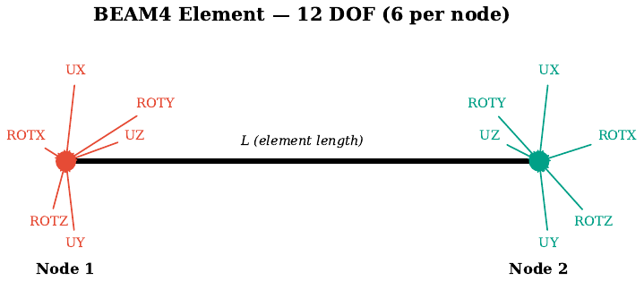
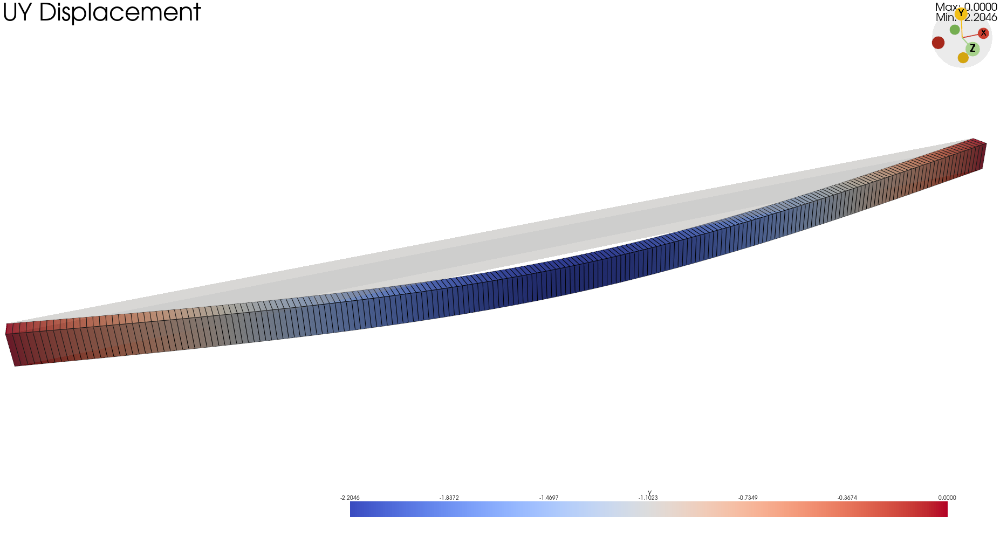
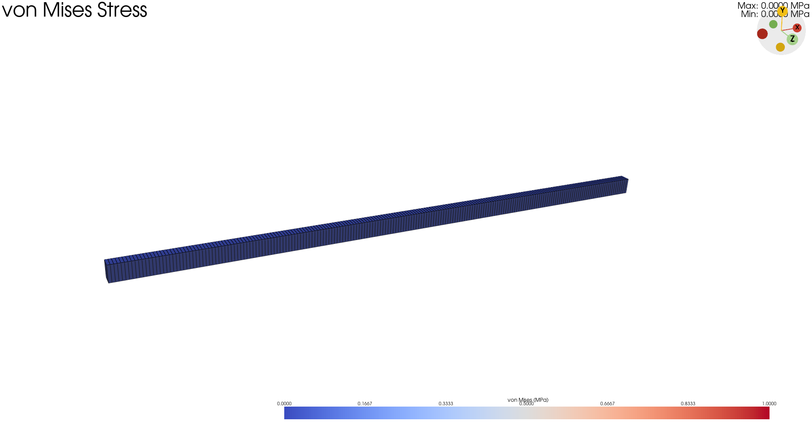
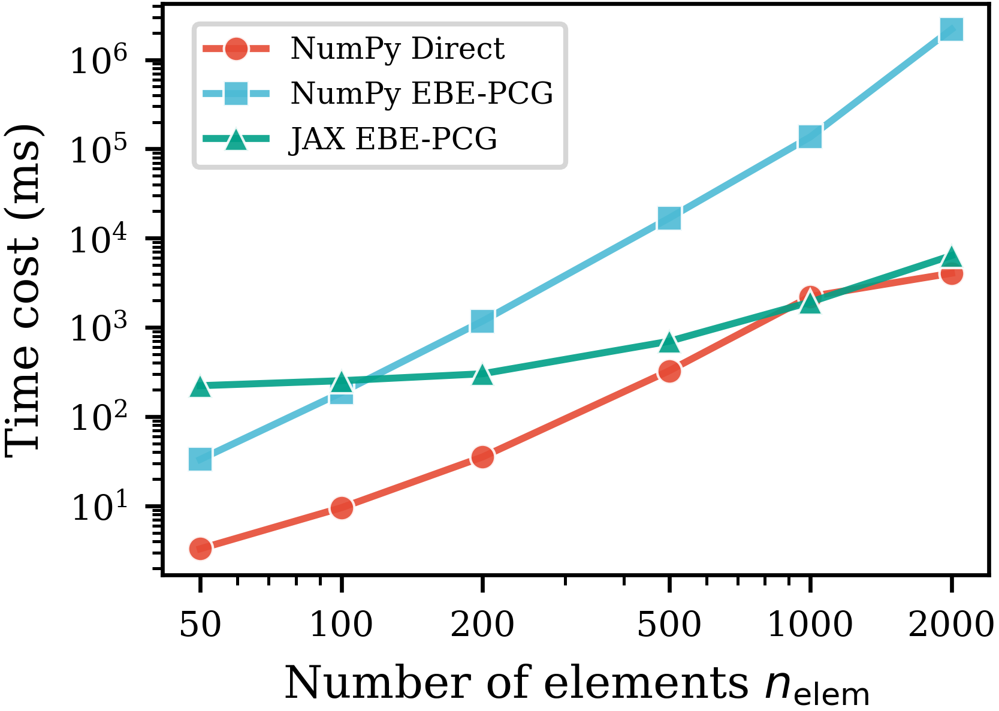
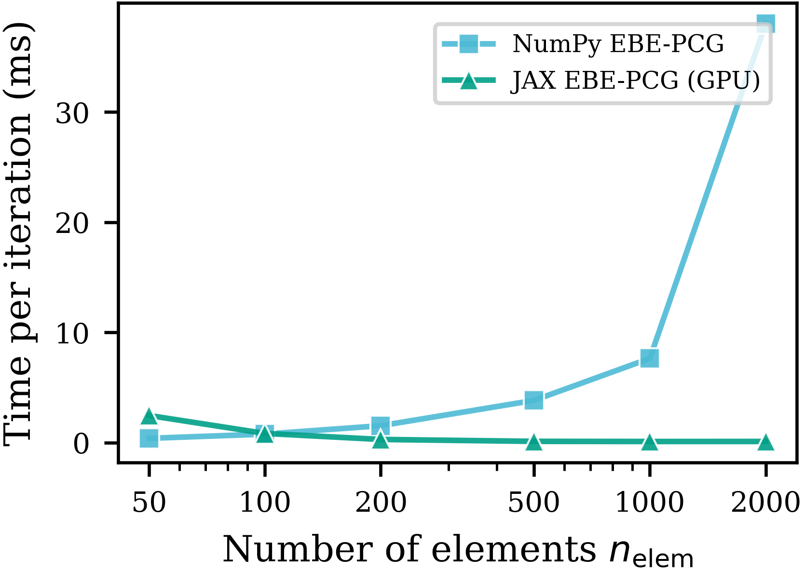
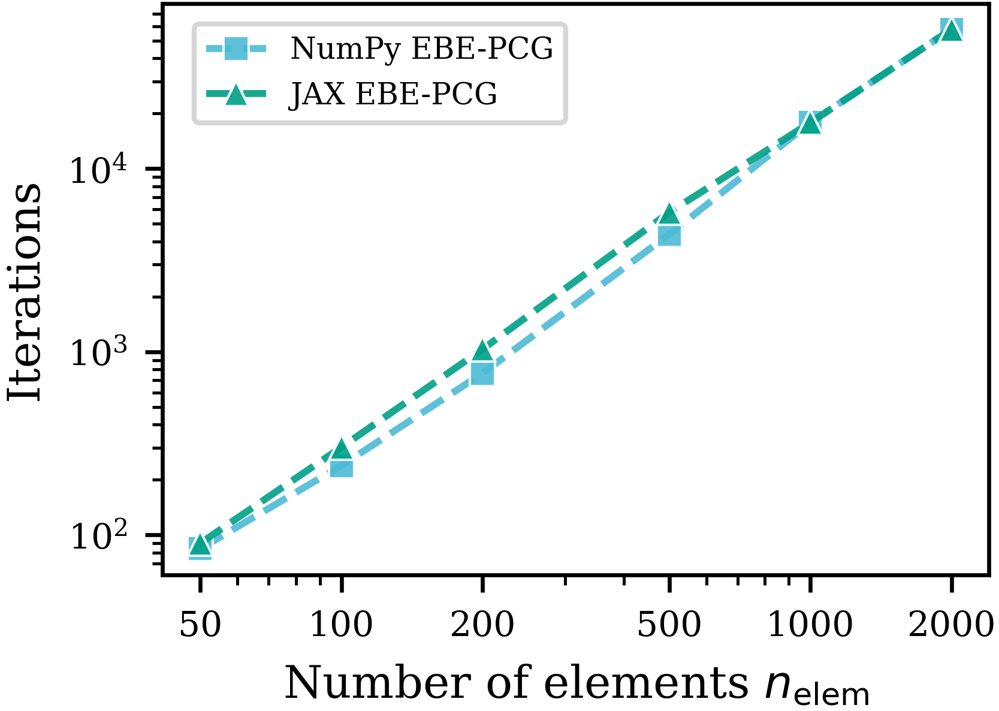

# 简支梁 EBE-PCG 可行性验证 Demo

[](https://github.com/Junrui-Zhang/JAXFEM)

> 🚀 **产品链接**：[JAXFEM Web 演示平台 →](product/README.md)
> 浏览器交互式参数调节、实时求解、3D 变形云图与 GPU 耗时对比。
>
> GitHub 仓库：<https://github.com/Junrui-Zhang/JAXFEM>

## 概述

本 demo 是硕士论文《大跨度桥梁抖振时域分析的GPU加速并行有限元算法》步骤 1.4 的可行性预验证。

验证目标：对一简支梁模型，分别用 NumPy 串行和 JAX GPU 并行两种方式实现 EBE-PCG 求解器，对比结果精度和计算速度。

<p align="center">
  
</p>
<p align="center"><em>beam4单元 12自由度</em></p>

## 模型参数

| 参数 | 值 | 说明 |
|------|-----|------|
| 跨度 L | 10 m | 梁全长 |
| 单元数 | 10 | 均匀划分 |
| 截面 | 0.2m × 0.3m | 矩形截面 |
| 弹性模量 E | 210 GPa | 钢材 |
| 密度 ρ | 7850 kg/m³ | - |
| 集中力 P | -10 kN | 跨中竖向 |
| 支座 | 简支 | 两端约束 UY |
| 单元类型 | 2D Euler-Bernoulli 梁 | 每节点 3DOF (UX, UY, ROTZ) |

**理论跨中挠度**：δ = PL³/(48EI) = **2.204 mm**（向下）

## 项目架构


数据流：ANSYS 模型（`simple_beam.inp`）→ `ansys_parser.py` 解析 → `beam_element.py` 生成单元刚度矩阵 → `post.py` 统一求解入口；求解器分 `numpy_ebe/`（串行，用于验证）与 `jax_ebe/`（vmap GPU 并行）两条路径，最终对比精度与耗时。

## 目录结构

```
JAXFEM/
├── README.md                    # 本文件（项目说明）
├── beam_element.py              # BEAM4 单元刚度矩阵（核心）
├── post.py                      # 统一求解入口 + 可视化类（核心）
├── ansys/                       # 模型生成 + ANSYS 导出解析（核心）
├── jax_ebe/                     # JAX EBE-PCG 求解器（vmap 并行）
├── numpy_ebe/                   # NumPy EBE-PCG 求解器（串行）
├── benchmark_data/              # 基准测试数据（.npy）
├── product/                     # ★ Web 产品（Dash 应用，见 product/README.md）
├── scripts/                     # 科研脚本：benchmark / 绘图 / 报告插图生成
├── docs/                        # 文档：使用手册 / 技术报告 / PPT 指南
└── figures/                     # 全部图件（论文插图 + 基准曲线 + 云图截图）
```

## 运行方式

### 1. 命令行求解（推荐）
```bash
/home/zjr/anaconda3/envs/jaxfem/bin/python3 post.py --n-elem 200 --solver jax
```

### 2. Web 产品（参数调节 + 3D 云图 + 耗时对比）
```bash
/home/zjr/anaconda3/envs/jaxfem/bin/python3 product/app.py
# 浏览器打开 http://127.0.0.1:8050
```

> 产品详情、功能清单与演示脚本见 [product/README.md](product/README.md)。

### 3. 基准测试与绘图
```bash
/home/zjr/anaconda3/envs/jaxfem/bin/python3 scripts/benchmark.py      # 跑 benchmark（耗时较长）
/home/zjr/anaconda3/envs/jaxfem/bin/python3 scripts/plot_benchmark.py # 生成耗时对比图 → figures/
```

### 4. ANSYS 验证（需要安装 ANSYS）
```bash
# 启动 ANSYS APDL，读取 ansys/simple_beam.inp
# File → Read Input from... → simple_beam.inp
```

## 预期验证结果

| 指标 | NumPy EBE-PCG | JAX EBE-PCG | ANSYS 参考 | 解析解 |
|------|:---:|:---:|:---:|:---:|
| 跨中挠度 | ≈2.204 mm | ≈2.204 mm | ≈2.204 mm | 2.204 mm |
| 求解迭代次数 | - | - | - | - |

求解后的变形云图（3D 实体梁，截面扫掠渲染）：

| UY 挠度云图 | von Mises 应力云图 |
|---|---|
|  |  |

## 性能对比（GPU 加速）

三种求解方式（NumPy 直接解 / NumPy EBE-PCG / JAX EBE-PCG）的耗时对比，以及随模型规模的扩展趋势：

<p align="center">
  
</p>
<p align="center"><em>总耗时对比：模型规模增大时，JAX GPU 并行优势显著</em></p>

| 单次迭代耗时 | 迭代次数随规模变化 |
|---|---|
|  |  |

## 关键概念

### EBE (Element-by-Element) 核心运算

- **真向量** $x^e$：只包含单元自身节点的值（6维）
- **伪向量** $x^{(e)}$：包含单元自身 + 相邻单元共享节点的值
- **内积分解**：$(r,r) = \sum_{e=1}^E (r^e)^T r^{(e)}$
- **$p^TAp$ 分解**：$(p,Ap) = \sum_{e=1}^E (p^{(e)})^T A^e p^{(e)}$


### 邻接关系

对梁单元链（单元 e 连接节点 e 和 e+1）：
- 单元 e 与单元 e-1 共享节点 e
- 单元 e 与单元 e+1 共享节点 e+1
